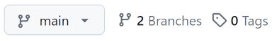

# 원격 추적 브랜치 {#remote-tracking-branch}

[i[Branch-->Remote tracking]<]

작업할 로컬 브랜치를 만들고, `main` 브랜치로 다시 병합한 다음, 원격 서버로 `git push`하는 방법을 살펴봤습니다.

이 장에서는 무대 뒤에서 실제로 무슨 일이 일어나는지 명확히 설명하고, 안전하게 보관하도록 로컬 브랜치를 원격 저장소에 푸시하는 방법도 알아봅니다.

## 원격 저장소의 브랜치 {#branches-on-remotes}

[i[Branch-->On remote]<]

먼저 복습해 봅시다!

여러분이 클론해 온 원격 저장소는 여러분 저장소의 완전한 복사본이라는 점을 기억하세요. 원격 저장소에 `main` 브랜치가 있으므로 여러분의 클론에도 `main` 브랜치가 있습니다.

맞습니다! GitHub 저장소를 만든 뒤 클론하면 `main` 브랜치가 **두 개** 있습니다!

둘을 어떻게 구분할까요?

로컬 클론에서는 브랜치를 평범한 이름으로만 부릅니다. `main`이나 `topic2`라고 하면 우리 저장소에 있는 그 이름의 로컬 브랜치를 뜻합니다.

원격 저장소에 있는 브랜치를 말하려면 앞에서 본 슬래시 표기법으로 원격 저장소 이름과 브랜치 이름을 함께 써야 합니다.

``` {.default}
main            # main branch on your local repo
origin/main     # main branch on the remote named origin
upstream/main   # main branch on the remote named upstream
zork/mailbox    # mailbox branch on the remote named zork
mailbox         # mailbox branch on your local repo
```

중요한 점은 일상적인 대화에서 `origin/main`이 `origin`의 `main` 브랜치를 가리킬 뿐 아니라, _실제로 로컬 저장소에 `origin/main`이라는 브랜치가 있다는 것_입니다.

이를 *원격 추적 브랜치*라고 합니다. 원격 저장소의 `main` 브랜치를 로컬에 복사해 둔 것입니다. 로컬의 `origin/main` 브랜치를 직접 움직일 수는 없습니다. 원격 저장소와 상호 작용할 때(예: 푸시하거나 풀할 때) Git이 으레 대신 움직입니다.

로컬 컴퓨터의 `main` 브랜치를 _로컬 브랜치_, `origin`에 있는 브랜치를 *업스트림 브랜치*라고 부르겠습니다.

> **그리고 뒤에서는 혼란스러워집니다.** 여기서 사용하는 *업스트림 브랜치*라는 용어와 전혀 관계없는 방식으로 원격 저장소에 `upstream`이라는 이름을 붙이기 때문입니다.

확실히 이해하도록 한 번 더 살펴보겠습니다.

`origin`의 원격 저장소를 방금 클론하여 컴퓨터에 다음 두 브랜치가 있다고 합시다.

``` {.default}
main            # main branch on your local repo
origin/main     # main branch on the remote named origin
```

컴퓨터에 이 두 브랜치가 있을 때 *세상에는 실제로 브랜치가 세 개 있습니다*.

1. 여러분의 컴퓨터에 있는 `main`
2. 여러분의 컴퓨터에 있는 `origin/main`
3. `origin` 컴퓨터에 있는 `main`. 보통 GitHub 같은 곳에 있는 여러분의 컴퓨터와 다른 컴퓨터입니다.

첫 두 브랜치는 여러분의 컴퓨터에 있는 저장소에 존재한다는 점에 주목하세요!

`origin/main` 브랜치는 `origin`의 `main`이 어디에 있다고 여러분의 컴퓨터가 *생각하는지* 나타낼 뿐입니다. 마지막으로 `origin`에서 풀하거나 페치했을 때 이 정보를 받았습니다.

마지막으로 풀한 뒤 다른 사람이 `origin`의 `main`에 푸시했다면 로컬 컴퓨터의 `origin/main`은 최신 상태가 아닙니다.

보통은 이를 크게 걱정할 필요가 없습니다. 푸시하려 할 때 그사이에 다른 사람이 변경 사항을 푸시했다면 Git이 알려 주고, 먼저 풀하여 `origin/main` 브랜치를 업데이트하라고 합니다. 별일 아닙니다.

다만 여기서 무대 뒤에 무슨 일이 일어나는지 더 완전한 사고 모형을 갖도록 자세히 설명하고 싶었습니다.

[i[Branch-->On remote]>]

## 원격 추적 브랜치 목록 보기 {#listing-remote-tracking-branches}

[i[Branch-->Listing remote tracking]<]

`git branch`가 보유한 브랜치 목록을 보여 줬던 것을 기억하나요? 원격 추적 브랜치도 모두 볼 수 있도록 강화해 봅시다. 다음 절들을 이해하는 데 도움이 됩니다.

기본적으로 `-avv` 옵션을 줍니다. "all"(원격 추적 브랜치까지 나열), "verbose"(브랜치가 가리키는 커밋 정보 표시), 그리고 다시 "verbose"(어느 원격 브랜치가 어느 로컬 브랜치에 대응하는지 표시)를 뜻합니다.

이 책의 소스를 담은 저장소에서는 다음과 같은 결과가 나옵니다.

``` {.default}
% git branch -avv
  * main                  2d63af5 [origin/main] indexing
    sphinx                cdac325 [origin/sphinx] partial port
    remotes/origin/HEAD   -> origin/main
    remotes/origin/main   2d63af5 indexing
    remotes/origin/sphinx cdac325 partial port
```

로컬 브랜치 두 개(`main`과 `sphinx`)가 보입니다. 위쪽 두 줄에는 원격 추적 브랜치가 대괄호 안에 보입니다(`origin/main`과 `origin/sphinx`). `main`이나 `sphinx`에서 푸시하거나 풀할 때 대응하는 원격 추적 브랜치가 바로 이것입니다.

그 아래에는 원격 저장소에 관한 정보도 보입니다.

`remotes/origin/HEAD`에 관한 첫 줄은 조금 이상합니다. 단순히 `origin/main`을 가리키며, 저장소를 클론할 때 Git이 사용할 초기 브랜치가 `main`임을 알려 줍니다. 보통은 이 줄을 신경 쓸 필요가 없습니다.

나머지 두 줄은 원격 추적 브랜치 `origin/main`과 `origin/sphinx`가 어느 커밋을 가리키는지 알려 줍니다. 자세히 보면 로컬 `main`과 `sphinx`와 같은 커밋을 가리키므로 모든 것이 동기화된 상태입니다. (우리가 아는 한에서 말입니다. 마지막으로 풀한 뒤 누군가 저장소에 무언가를 푸시했지만 아직 모를 수도 있습니다.)

[i[Branch-->Listing remote tracking]>]

## 원격 저장소로 푸시하기 {#pushing-to-a-remote}

[i[Branch-->Set upstream]<]

재미있는 사실: 푸시하거나 풀할 때는 엄밀히 말해 사용할 원격 저장소와 브랜치를 지정합니다. 다음 명령은 "지금 있는 브랜치(아마 `main`)를 푸시하여 `origin`의 `main`에 병합해 줘"라는 뜻입니다.

[i[Push-->Branch to remote]]
[i[Branch-->Pushing to remote]]
``` {.default}
$ git push origin main
```

"잠깐만요! 저는 그렇게 한 적이 없는데요!"

자동으로 처리하게 만드는 옵션이 있습니다. `main` 브랜치에서 다음 명령을 실행한다고 합시다.

``` {.default}
$ git push --set-upstream origin main
$ git push -u origin main              # same thing, shorthand
```

이 명령은 두 가지 일을 합니다.

1. 로컬 `main`의 변경 사항을 원격 서버로 푸시합니다(`push origin main` 부분).
2. 로컬 `main` 브랜치가 원격 브랜치 `origin/main`을 추적한다는 사실을 기억합니다(`-u` 부분).

그 뒤부터는 `main` 브랜치에서 다음 명령만 실행하면 됩니다.

``` {.default}
$ git push
```

앞서 `--set-upstream`을 사용한 덕분에 `origin`의 `main`으로 자동 푸시하고 로컬의 `origin/main` 브랜치도 업데이트합니다.

`git pull`에도 같은 옵션이 있지만 푸시나 풀 어느 한쪽에서 한 번만 사용하면 됩니다.

"잠깐만요! 저는 `--set-upstream`도 사용한 적이 없는데요!"

기본적으로 저장소를 클론할 때 Git이 로컬 브랜치에서 원격 저장소의 `main` 브랜치를 추적하도록 자동으로 마법처럼 설정하기 때문입니다.

> **저장소를 만든 방법에 따라 `origin/HEAD` 참조도 있을 수 있습니다.** 원격 서버에 여러분이 볼 수 있는 `HEAD` 참조가 있다고 생각하면 이상할 수 있지만, 여기서는 저장소를 클론할 때 기본으로 체크아웃할 브랜치를 가리킬 뿐입니다.

"그러니까 늘 하던 대로 `git push`와 `git pull`만 실행하고 이 절에서 쓴 내용은 전부 무시해도 된다는 말인가요?"

음… 네. 어느 정도는요. 아니기도 합니다. 다른 브랜치를 원격 저장소로 푸시할 때 이 내용을 활용할 것입니다!

[i[Branch-->Set upstream]>]

## 브랜치를 만들어 원격 저장소로 푸시하기 {#making-a-branch-and-pushing-to-remote}

[i[Push-->Branch to remote]<]

새 로컬 브랜치 `topic99`를 만들겠습니다.

``` {.default}
$ git switch -c topic99
  Switched to a new branch 'topic99'
```

그리고 몇 가지를 변경합니다.

``` {.default}
$ vim README.md        # Create and edit a README
$ git add README.md
$ git commit -m "Some important additions"
```

로그에서 모든 브랜치의 위치를 볼 수 있습니다.

``` {.default}
commit 79ddba75b144bad89e1cbd862e5f3b3409f6c498 (HEAD -> topic99)
Author: User Name <user@example.com>
Date:   Fri Feb 16 16:44:50 2024 -0800

    Some important additions

commit 3be2ad2c31b627b431af8c8e592c01f4b989d621 (origin/main, main)
Author: User Name <user@example.com>
Date:   Fri Feb 16 16:14:13 2024 -0800

    Initial checkin
```

`HEAD`는 `topic99`를 가리키며, 이는 우리가 아는 한 `main`(로컬)과 `main`(`origin` 원격 저장소의 업스트림)보다 커밋 하나 앞에 있습니다. 원격 추적 브랜치 `origin/main`보다 커밋 하나 앞서 있으므로 이를 알 수 있습니다.

이제 푸시해 봅시다!

``` {.default}
$ git push
  fatal: The current branch topic99 has no upstream branch.
  To push the current branch and set the remote as upstream, use

      git push --set-upstream origin topic99

  To have this happen automatically for branches without a tracking
  upstream, see 'push.autoSetupRemote' in 'git help config'.
```

아야. 요약하면 우리가 "푸시해"라고 했더니 Git이 "어디로요? 이 브랜치를 원격 저장소의 어떤 것과도 연결하지 않았잖아요!"라고 답한 것입니다.

실제로 연결하지 않았습니다. `origin/topic99` 원격 추적 브랜치도 없고, 그 원격 저장소에는 당연히 `topic99` 브랜치도 없습니다. 아직은 말입니다.

해결법은 충분히 쉽습니다. Git이 이미 무엇을 해야 하는지 알려 줬습니다.

[i[Branch-->Set upstream]]

```{.default}
$ git push --set-upstream origin topic99
```

이것으로 됩니다.

[i[GitHub-->Branches]]

이 시점에 GitHub로 푸시했다면 프로젝트의 GitHub 페이지로 이동하세요. 왼쪽 위 근처에 그림_#.1과 비슷한 것이 보일 것입니다.



`main` 버튼을 펼치면 `topic99`도 보입니다. 어느 브랜치든 선택하여 GitHub 인터페이스에서 볼 수 있습니다.

[i[Push-->Branch to remote]>]

## 원격 추적 브랜치 삭제하기 {#deleting-remote-tracking-branches}

[i[Branch-->Deleting remote]<]
[i[Branch-->Deleting remote tracking]<]

여기서는 몇 가지 상황이 생길 수 있습니다.

1. 누군가 원격 저장소에서 브랜치를 삭제했지만 대응하는 원격 추적 브랜치(여러분의 클론에 있는 것)는 여전히 존재하여 이를 삭제하고 싶습니다.

2. 원격 추적 브랜치는 삭제하되 원격 저장소의 대응하는 브랜치는 그대로 두고 싶습니다.

3. 원격 추적 브랜치를 삭제하고 원격 저장소의 대응하는 브랜치도 삭제하고 싶습니다.

물론 어느 경우든 작업 트리를 깨끗하게 해 두는 것이 좋습니다.

### 삭제된 원격 브랜치 페치하기 {#fetching-deleted-remote-branches}

첫 번째는 꽤 쉽습니다. `origin` 원격 저장소에 더는 존재하지 않는 원격 추적 브랜치를 모두 삭제하라고 Git에 지시합시다.

[i[Fetch-->Pruning remote tracking branches]]
``` {.default}
$ git fetch --prune
```

원격 저장소를 지정하려면 다음과 같이 합니다.

``` {.default}
$ git fetch --prune someremote
```

모든 원격 저장소를 프루닝하려면 다음과 같이 합니다.

``` {.default}
$ git fetch --prune --all
```

### 내 원격 추적 브랜치 삭제하기 {#deleting-your-remote-tracking-branch}

이 경우에는 클론에 있는 원격 추적 브랜치를 삭제하려 합니다. 하지만 서버에서는 그 브랜치를 삭제하고 싶지 않습니다.

삭제를 뜻하는 `-d`와 원격을 뜻하는 `-r`을 사용합니다.

``` {.default}
$ git branch -dr remote/branch
``` 

예를 들면 다음과 같습니다.

``` {.default}
$ git branch -dr origin/topic99
``` 

### 원격 저장소의 브랜치 삭제하기 {#deleting-a-branch-on-a-remote}

마지막으로 위에서처럼 클론의 원격 추적 브랜치를 삭제했고, 원격 저장소에서도 해당 브랜치를 삭제하고 싶다고 합시다.

(어쩌면 놀랍게도) 여기에 `git push`를 사용합니다.

원격 저장소의 브랜치를 삭제하려면 다음과 같이 합니다.

``` {.default}
$ git push someremote --delete branchname
``` 

예를 들면 다음과 같습니다.

``` {.default}
$ git push origin --delete topic99
``` 

이것으로 끝입니다! 원격 추적 브랜치를 아직 삭제하지 않았다면 꼭 삭제하세요.

[i[Branch-->Deleting remote]>]
[i[Branch-->Deleting remote tracking]>]

## 여러 원격 저장소 {#multiple-remotes}

[i[Remote-->Multiple]<]

원격 저장소가 여러 개일 수도 있습니다. (GitHub에서 다른 사람의 저장소를 포크했을 때 흔히 이렇게 설정합니다.)

이 경우 원격 추적 브랜치는 어떻게 작동할까요?

평소처럼 주 원격 저장소의 이름이 `origin`이라고 합시다. 그리고 독창성 없이 `remote2`라는 다른 원격 저장소도 설정했습니다.

다른 사람이 `remote2`에 `foobranch`라는 새 브랜치(조금 더 독창적이군요)를 푸시했고 이를 받고 싶습니다.

따라서 다음과 같이 합니다.

[i[Fetch]]

``` {.default}
$ git fetch remote2
  remote: Enumerating objects: 15, done.
  remote: Counting objects: 100% (15/15), done.
  remote: Compressing objects: 100% (4/4), done.
  remote: Total 12 (delta 6), reused 11 (delta 5), pack-reused 0
  Unpacking objects: 100% (12/12), 1.61 KiB | 34.00 KiB/s, done.
  From github.com:user/somerepo
   * [new branch]      foobranch -> remote2/foobranch
```

여기까지 좋습니다. 그 브랜치로 전환해 봅시다.

``` {.default}
$ git switch foobranch
  branch 'foobranch' set up to track 'remote2/foobranch'.
  Switched to a new branch 'foobranch'
```

잠깐만요! `remote2`의 브랜치를 추적한다고요? 다른 사람의 저장소이므로 조금 이상합니다. 그곳에 쓸 권한이 있고 이것이 원하는 동작일 수도 있습니다. 하지만 이 브랜치의 자신만의 버전을 자기 저장소에도 두고 싶은 경우가 더 많을 것입니다.

다시 `-u`를 붙여 여러분의 원격 저장소에 푸시하면 됩니다.

``` {.default}
$ git push -u origin foobranch
```

이것으로 됩니다.

`git branch -avv`로 브랜치를 보면 이제 서로 다른 클론에 해당하는 `foobranch` 변형이 여러 개 보입니다.

``` {.default}
foobranch
remotes/origin/foobranch
remotes/remote2/foobranch
```

`origin/foobranch`를 `remote2`의 브랜치와 계속 동기화하려면 병합 작업을 여러 번 해야 합니다.

[i[Fetch]]

``` {.default}
$ git fetch remote2            # Get remote2 changes
$ git switch foobranch         # Get onto the merge-into branch
$ git merge remote2/foobranch  # Merge changes from remote2
$ git push origin foobranch    # Push changes back to origin
```

(물론 앞에서 이미 `-u`를 붙여 푸시했다면 `push` 명령에서 `origin foobranch`를 생략할 수 있습니다.)

이 시점에는 모든 `foobranch`가 같은 커밋에 있어야 합니다.

[i[Remote-->Multiple]>]
[i[Branch-->Remote tracking]>]
