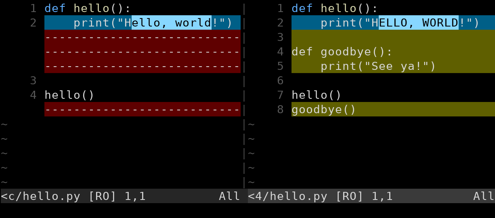

# Difftool {#difftool-1}

[i[Difftool]<]

솔직히 이 diff 출력은 읽기 어렵습니다. 그래도 정말로 익숙해지기는 합니다. 저는 늘 사용합니다.

그렇다고 해도 좀 더 *시각적인* 방식, 이를테면 왼쪽에는 이전 버전, 오른쪽에는 새 버전을 놓아 눈으로 더 쉽게 이해할 수 있게 보는 편이 좋을 때가 있습니다.

> **VS Code나 몇몇 다른 IDE를 사용한다면 훌륭한 diff 기능이 기본으로 제공되므로 이 절을 꼭 읽을 필요는 없습니다.** 자세한 내용은 VS Code 장을 보세요.

먼저 나쁜 소식부터 말하면 Git은 이 기능을 기본으로 지원하지 않습니다.

좋은 소식은 이 일을 해 주는 서드 파티 도구가 많고, Git과 아주 쉽게 연동하도록 설정할 수 있다는 것입니다.

얼마나 쉬울까요?

한 번 설정하고 나면 명령줄에서 `diff` 대신 `difftool`이라고 쓰기만 하면 됩니다. 예를 들면 다음과 같습니다.

``` {.default}
$ git difftool HEAD~3^!
```

그러면 무엇을 볼 수 있을까요? 저는 Vim을 쓰고 Vimdiff를 difftool로 설정했으므로 그림_#.1과 같은 화면이 나타납니다.



흑백으로는 조금 알아보기 어려울 수 있지만, 왼쪽에는 이전 버전이 있고 오른쪽에는 새 버전이 있습니다. 왼쪽의 빼기 기호로 된 줄은 이전 버전에 존재하지 않는 줄을 나타내고, 오른쪽에서는 새 버전에 존재하는 줄이 강조되어 있는 것을 볼 수 있습니다.

하지만 아무 설정 없이 곧바로 `git difftool`을 실행하면 작동하지 않습니다. 먼저 설정해야 합니다.

## 설정하기 {#configuring}

[i[Difftool-->Configuration]<]

첫째, Git은 보통 서드 파티 difftool을 실행하기 전에 사용자에게 묻습니다. 번거로우므로 전역 설정에서 꺼 봅시다.

``` {.default}
$ git config --global difftool.prompt false
```

둘째, 어떤 도구를 사용할지 알려 주어야 합니다.

``` {.default}
$ git config --global diff.tool vimdiff
```

이것만으로 충분할 수도 있습니다. `vimdiff`(또는 사용하는 다른 diff 도구)가 `PATH`[^43a2]에 있다면 이제 준비가 끝난 것입니다.

[^43a2]: `PATH` 설정은 이 튜토리얼의 범위를 벗어나지만, 간단히 말해 diff 도구 명령을 명령줄에서 실행할 수 있다면(예: `vimdiff` 실행) 그 도구는 `PATH`에 있습니다. `command not found` 같은 메시지가 나온다면 `PATH`에 **없는** 것입니다. Bash에서 어떤 항목을 `PATH`에 추가하는 방법을 인터넷에서 검색해 보세요. 또는 다음 문단처럼 Git 경로 설정을 명시적으로 지정하세요.

홈 디렉터리 트리 어딘가에 로컬로 설치해서 도구가 `PATH`에 없다면, `PATH`에 추가하거나(방법은 인터넷에서 찾아보세요) 해당 difftool의 전체 경로를 지정할 수 있습니다. 다음은 `vimdiff`를 사용하는 예입니다. 제 환경에서는 `/usr/bin`이 이미 `PATH`에 있으므로 이 설정은 불필요합니다.

``` {.default}
$ git config --global difftool.vimdiff.path /usr/bin/vimdiff
```

`vimdiff`가 아닌 다른 difftool을 사용한다면 설정 줄에서 그 부분을 해당 명령 이름으로 바꾸세요.

다시 말하지만 도구가 표준 위치에 설치되어 있지 않을 때만 경로를 설정하면 됩니다.

[i[Difftool-->Configuration]>]

## 사용할 수 있는 Difftool {#available-difftools}

선택할 수 있는 diff 도구는 많습니다. 아래는 일부만 추린 목록이며, 저는 Vimdiff밖에 써 보지 않았다는 점을 감안해 주세요.

* [fl[Araxis Merge|https://www.araxis.com/merge/index.en]]
* [fl[Beyond Compare|https://www.scootersoftware.com/]]
* [fl[DiffMerge|https://sourcegear.com/diffmerge/]]
* [fl[Kdiff3|https://kdiff3.sourceforge.net/]]
* [fl[Kompare|https://apps.kde.org/kompare/]]
* [fl[Meld|https://meldmerge.org/]]
* [fl[P4Merge|https://www.perforce.com/products/helix-core-apps/merge-diff-tool-p4merge]]
* Vimdiff([fl[Vim|https://www.vim.org/]]에 포함)
* [fl[WinMerge|https://winmerge.org/?lang=en]]

이들 중에는 무료도 있고 유료도 있으며 무료 체험판을 제공하는 것도 있습니다.

그리고 VS Code는 difftool을 사용하지 않아도 이 기능을 제공한다는 것을 기억하세요.

[i[Difftool]>]
